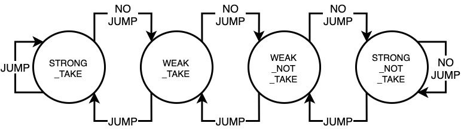
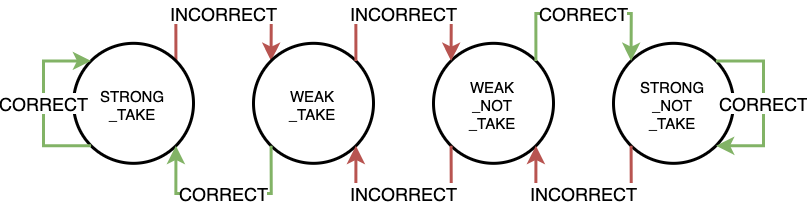

# 2 Bit Predictor Simulation
This program simulates branch prediction performed by a 2-bit predictor.
The simulation also calculates the hit rate of a 2-bit predictor with a given branch history.

- [How to use](#how-to-use)
- [Types of Predictors](#types-of-predictors)
  - [1. TwoBitPredictorByBranchResult](#1-twobitpredictorbybranchresult)
  - [2. TwoBitPredictorByPredictionResult](#2-twobitpredictorbypredictionresult)
- [(No) Difference between the Two Predictors](#no-difference-between-the-two-predictors)

## How to use
### Run the Simulation
```sh
$ python3 main.py
```

### Modify the Branch History
Change the size of (randomly-generated) branch history
```py
# main.py

# branch history of size 100
branch_history = get_branch_history(history_size=100)

# branch history of size 1000
branch_history = get_branch_history(history_size=1000)
```

Use a custom branch history by changing what the `get_branch_history()` function returns.
```py
# main.py

# Before: randomly-generated
def get_branch_history(history_size: int = 10) -> List[BranchResult]:
    return[ BranchResult.JUMP if randint(0, 1) == 1 else BranchResult.NO_JUMP for _ in range(history_size) ]

# After: custom
def get_branch_history() -> List[BranchResult]:
    return [
        BranchResult.JUMP,
        BranchResult.JUMP,
        BranchResult.JUMP,
        BranchResult.NO_JUMP,
        # ...
        BranchResult.JUMP,
        BranchResult.JUMP,
        BranchResult.NO_JUMP,
    ]
```

### Output State Transition
Don't print State Transition
```py
# main.py

SHOW_STATE_TRANSITION = False
```
Output:
```sh
Branch History
[<BranchResult.JUMP: True>, <BranchResult.JUMP: True>, <BranchResult.JUMP: True>, <BranchResult.NO_JUMP: False>, <BranchResult.JUMP: True>]
Predictor with Branch Result
Hit Rate: 0.6
Predictor with Prediction Result
Hit Rate: 0.6
```

Print State Transition
```py
# main.py

SHOW_STATE_TRANSITION = True
```
Output:
```sh
Branch History
[<BranchResult.NO_JUMP: False>, <BranchResult.JUMP: True>, <BranchResult.JUMP: True>, <BranchResult.JUMP: True>, <BranchResult.NO_JUMP: False>]
Predictor with Branch Result
jumped: BranchResult.NO_JUMP, prediction: BranchResult.NO_JUMP, next_state: TwoBitPredictorState.STRONG_NOT_TAKE
jumped: BranchResult.JUMP, prediction: BranchResult.NO_JUMP, next_state: TwoBitPredictorState.WEAK_NOT_TAKE
jumped: BranchResult.JUMP, prediction: BranchResult.NO_JUMP, next_state: TwoBitPredictorState.WEAK_TAKE
jumped: BranchResult.JUMP, prediction: BranchResult.JUMP, next_state: TwoBitPredictorState.STRONG_TAKE
jumped: BranchResult.NO_JUMP, prediction: BranchResult.JUMP, next_state: TwoBitPredictorState.WEAK_TAKE
Hit Rate: 0.4
Predictor with Prediction Result
jumped: BranchResult.NO_JUMP, prediction: BranchResult.NO_JUMP, next_state: TwoBitPredictorState.STRONG_NOT_TAKE
jumped: BranchResult.JUMP, prediction: BranchResult.NO_JUMP, next_state: TwoBitPredictorState.WEAK_NOT_TAKE
jumped: BranchResult.JUMP, prediction: BranchResult.NO_JUMP, next_state: TwoBitPredictorState.WEAK_TAKE
jumped: BranchResult.JUMP, prediction: BranchResult.JUMP, next_state: TwoBitPredictorState.STRONG_TAKE
jumped: BranchResult.NO_JUMP, prediction: BranchResult.JUMP, next_state: TwoBitPredictorState.WEAK_TAKE
Hit Rate: 0.4
```

## Inner State of 2 Bit Predictor
```py
# main.py

class TwoBitPredictorState(Enum):
    STRONG_NOT_TAKE = 0
    WEAK_NOT_TAKE = 1
    WEAK_TAKE = 2
    STRONG_TAKE = 3
```

## Types of Predictors
There are two predictors defined in this program.

### 1. TwoBitPredictorByBranchResult
Branch Result shows whether the program counter should jump (to a different address) or not.
```py
# main.py

class BranchResult(Enum):
    JUMP = True
    NO_JUMP = False
```
#### State Transition Diagram
<figure>
    
    <figcaption>Fig 1. State Transition Diagram with Branch Result as input</figcaption>
</figure>

### 2. TwoBitPredictorByPredictionResult
Prediction Result shows whether a prediction made is correct or not.
```py
# main.py

class PredictionResult(Enum):
    CORRECT = True
    INCORRECT = False
```
#### State Transition Diagram
<figure>
    
    <figcaption>Fig 2. State Transition Diagram with Prediction Result as input</figcaption>
</figure>

## (No) Difference between the Two Predictors
Although both predictors have different state transition diagrams, they behaves the same.
Both follows the same state transitions when the same sequence of branch results is provided.
For example, let's see how the inner state changes under the following conditions:
1. current inner state: WEAK_NOT_TAKE, branch result: JUMP
2. current inner state: WEAK_NOT_TAKE, branch result: NO JUMP

### Case 1
- current inner state: WEAK_NOT_TAKE
- branch result: JUMP

#### TwoBitPredictorByBranchResult
- **next state: WEAK_TAKE**

#### TwoBitPredictorByPredictionResult
- prediction made: NO JUMP
- branch result: JUMP
- prediction result: INCORRECT
- **next state: WEAK_TAKE**

### Case 2
- current inner state: WEAK_NOT_TAKE
- branch result: NO JUMP

#### TwoBitPredictorByBranchResult
- **next state: STRONG_NOT_TAKE**

#### TwoBitPredictorByPredictionResult
- prediction made: NO JUMP
- branch result: NO JUMP
- prediction result: CORRECT
- **next state: STRONG_NOT_TAKE**
